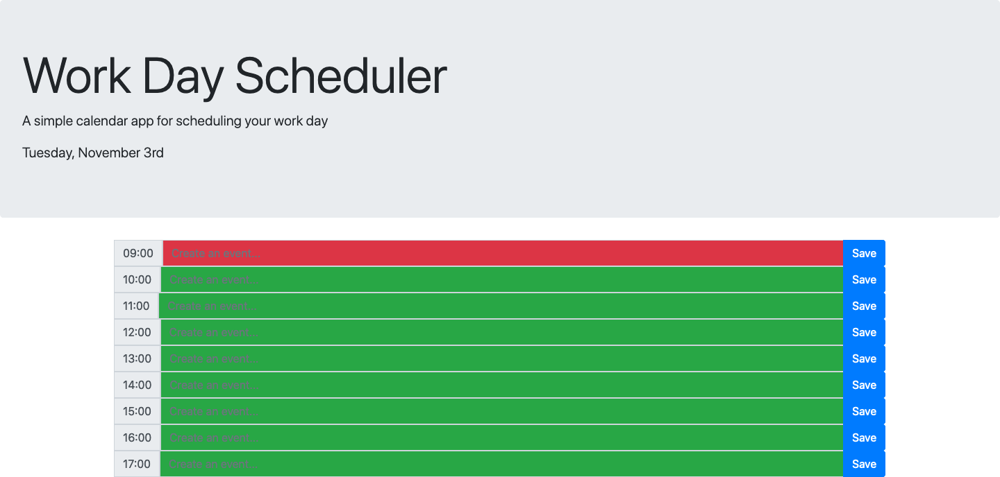

# Work Day Scheduler

## Description 
A web-based calendar application that allows the user to create, save and restore events for each hour of the day.

## Table of Contents

* [Usage](#usage)
* [Screenshot](#screenshot)
* [Credits](#credits)
* [License](#license)
* [Test Cases](#tests)

## Usage 
Access web-page here: (https://omair-muhi.github.io/work-day-scheduler/)

## Screenshot

## Credits
* UoT FSF Bcamp - this template
* W3Schools - (https://www.w3schools.com)

## License
MIT License

## Test Cases
### Main
1. Verify that correct day is displayed at top of page. -- OK
2. Verify that all time-blocks from 9-5pm are displayed. -- OK
#### Creating Events
1. Verify *no* input field is populated upon browser refresh while localDB is empty. -- OK
2. Verify localDB is correctly updated from *each* input field input when text is saved. -- OK
3. Verify *each* input field is populated correctly from localDB upon browser refresh.  -- OK
4. Verify *no* data is added to localDB if text field is empty. -- OK
### Time Blocks 
#### Input Fields
1. Verify that all time-blocks are green before 9am local time -- OK
2. Verify that all time-blocks are disabled after 5pm local time -- OK
3. Verify that top-half of time-blocks is disabled at 1pm local time -- OK
4. Verify that bottom-half of time-blocks is green at 1pm local time -- OK
6. Verify that 9am is red at 9am local time -- OK
7. Verify that 11am is red at 11am local time -- OK
8. Verify that 1pm is red at 1pm local time -- OK
9. Verify that 3pm is red at 3pm local time -- OK
10. Verify that 5pm is red at 5pm local time -- OK
#### Save Buttons
1. Verify that all buttons are active before 9am local time -- OK
2. Verify that all buttons are disabled after 5pm local time -- OK
3. Verify that top-half of buttons is disabled at 1pm local time -- OK
4. Verify that bottom-half of buttons is active at 1pm local time -- OK
6. Verify that 9am button is active at 9am local time -- OK
7. Verify that 11am button is active at 11am local time -- OK
8. Verify that 1pm button is active at 1pm local time -- OK
9. Verify that 3pm button is active at 3pm local time -- OK
10. Verify that 5pm button is active at 5pm local time -- OK
---
© 2019 Trilogy Education Services, a 2U, Inc. brand. All Rights Reserved.
